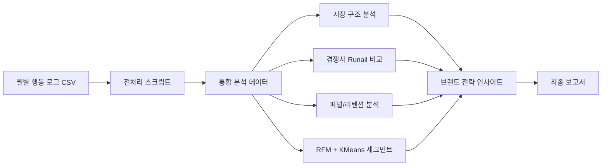
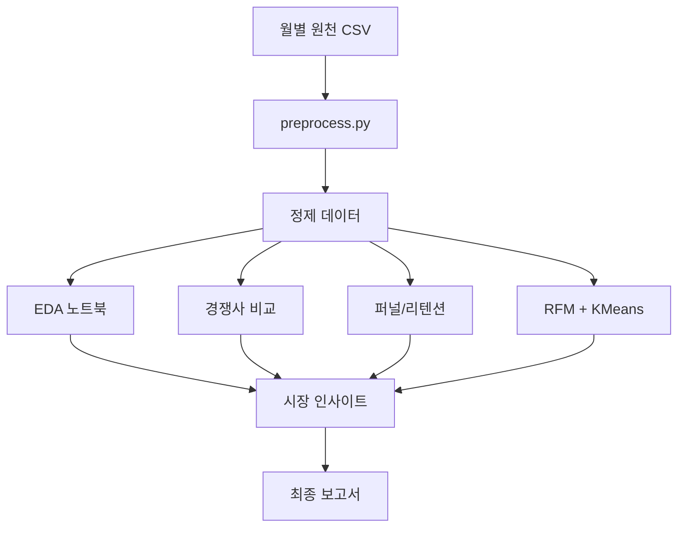

# Grattol CIS 네일시장 대응 프로젝트

Grattol이 러시아·CIS 네일 시장에서 어떤 전략을 써야 하는지 데이터로 분석한 프로젝트입니다.  
단순히 "매출이 올랐다/내렸다"를 보는 수준이 아니라,

- 시장 구조가 어떻게 생겼는지
- 경쟁사 Runail과 무엇이 다른지
- 고객을 어떤 그룹으로 나눌 수 있는지
- 어떤 시간대와 요일에 공략해야 하는지

를 실제 행동 로그 데이터로 해석하는 프로젝트입니다.

이 README는 이 저장소를 처음 보는 사람도 바로 이해할 수 있게 다시 정리한 문서입니다.

## 1. 30초 요약

이 프로젝트는 크게 3가지 질문에 답하려고 만들었습니다.

1. Grattol은 네일 시장에서 어떤 위치에 있는 브랜드인가?
2. 경쟁사 Runail과 비교하면 어디가 강하고 어디가 약한가?
3. 고객을 세그먼트로 나누면 누구를 먼저 잡아야 하는가?

이를 위해 아래 흐름으로 분석했습니다.

- 월별 행동 로그 전처리
- 시장 / 경쟁사 / 퍼널 / 리텐션 EDA
- RFM + KMeans 기반 고객 세그먼트 분석
- 보고서와 실행용 전처리 스크립트 정리

쉽게 말하면,

`시장 분석 + 경쟁사 비교 + 고객 세분화`를 한 번에 묶은 프로젝트입니다.

## 2. 이 프로젝트가 해결하려는 문제

네일 시장에서는 무조건 싸다고 이기는 것도 아니고,  
비싸다고 항상 프리미엄으로 통하는 것도 아닙니다.

Grattol은 안전성과 사용성 강점이 있지만, 시장 1위 경쟁사와 정면으로 붙으려면  
아래를 먼저 알아야 합니다.

- 고객이 언제 탐색하고 언제 구매하는지
- Grattol이 어디에서 Runail보다 약한지
- 어떤 고객이 충성 고객이고 어떤 고객이 이탈 위험군인지

즉, 이 프로젝트의 목표는  
`브랜드 감각`이 아니라 `데이터 근거`로 시장 전략을 짜는 것입니다.

## 3. 프로젝트 전체 구조



## 4. 이 저장소에서 실제로 하는 일

이 저장소는 Grattol 프로젝트의 핵심 코드와 최종 노트북, 보고서를 정리한 버전입니다.

핵심 구성은 아래와 같습니다.

- `src/preprocessing/preprocess.py`
  - 월별 CSV를 병합하고 분석용 데이터로 정리
- `notebooks/eda/14조_eda.ipynb`
  - 시장 구조, 경쟁사 비교, 퍼널 분석
- `notebooks/eda/14조_eda2.ipynb`
  - 시계열, 요일/시간대, 고객 행동 패턴 분석
- `notebooks/ml/14조_ML.ipynb`
  - RFM + KMeans 고객 세그먼트 분석
- `docs/reports/Grattol_통합_최종보고서.md`
  - 프로젝트 전체 결과 정리

즉, 이 저장소는 "코드 조각 모음"이 아니라  
`전처리 -> 분석 -> 세그먼트 -> 보고서` 흐름이 보이도록 정리된 저장소입니다.

## 5. 폴더 구조 설명

```text
Grattol_repo/
├── data/
│   └── README.md
├── docs/
│   ├── project/
│   └── reports/
├── notebooks/
│   ├── eda/
│   └── ml/
├── src/
│   └── preprocessing/
├── requirements.txt
└── README.md
```

### `src/preprocessing`

전처리 스크립트가 들어 있는 폴더입니다.

대표 파일:

- `src/preprocessing/preprocess.py`

이 스크립트는:

- 월별 CSV 읽기
- 브랜드 필터링
- 시간대 변환
- 컷오프 날짜 적용
- 클러스터 파일 병합
- 파생 변수 생성
- 메모리 최적화

를 한 번에 수행합니다.

쉽게 말하면, "분석 전에 데이터를 정리하는 자동화 코드"입니다.

### `notebooks/eda`

시장 구조와 고객 행동을 읽는 노트북입니다.

- `14조_eda.ipynb`
  - 시장 규모, 브랜드 비교, 퍼널, 리텐션
- `14조_eda2.ipynb`
  - 시계열, 요일/시간대 분석, 행동 패턴

### `notebooks/ml`

세그먼트 분석 노트북입니다.

- `14조_ML.ipynb`
  - RFM + Basket Size 설계
  - KMeans / MiniBatchKMeans 기반 군집화
  - 고객 세그먼트 해석

### `docs/reports`

최종 결과를 문서로 정리한 폴더입니다.

- `docs/reports/Grattol_통합_최종보고서.md`

이 문서를 보면 프로젝트 핵심 결과를 가장 빠르게 파악할 수 있습니다.

### `data`

원천 데이터와 대용량 산출물은 GitHub에 다 올라가 있지 않습니다.  
대신 `data/README.md`에 어떤 데이터가 빠져 있는지 안내가 정리돼 있습니다.

## 6. 데이터가 어떻게 흐르는가



## 7. 이 프로젝트의 핵심 분석 포인트

이 프로젝트는 크게 4가지 축으로 읽으면 됩니다.

### 1) 시장 구조 분석

전체 네일 시장에서 어떤 브랜드가 강한지, Grattol의 위치가 어디인지 봅니다.

### 2) 경쟁사 Runail 비교

Grattol과 Runail을 가격, 퍼널, 구매 패턴 기준으로 비교합니다.

핵심 질문:

- Runail은 왜 강한가?
- Grattol은 어떤 포지션으로 차별화해야 하는가?

### 3) 퍼널 / 리텐션 / 행동 패턴 분석

고객이

- 언제 상품을 탐색하고
- 언제 장바구니에 담고
- 언제 실제 구매하는지

를 시간대와 요일 기준으로 분석합니다.

### 4) 고객 세그먼트 분석

RFM과 장바구니 크기를 기반으로 고객을 나눕니다.

예:

- VIP salon
- Core repeaters
- At-risk
- New/light buyers
- Inactive/one-time

이렇게 세그먼트별로 다른 전략을 세울 수 있게 합니다.

## 8. 핵심 인사이트를 한 문장으로 말하면

이 프로젝트는  
`Grattol은 단순 저가 경쟁보다, 합리적 프리미엄 포지셔닝과 고객 세그먼트별 대응 전략이 더 중요하다`  

는 점을 데이터로 보여주는 프로젝트입니다.

## 9. 실행은 어떻게 하나요?

이 저장소는 웹서비스가 아니라,  
`전처리 스크립트 + 분석 노트북 + 최종 보고서` 중심의 구조입니다.

### 9-1. 환경 설치

```bash
pip install -r requirements.txt
```

### 9-2. 전처리 스크립트 실행

```bash
python src/preprocessing/preprocess.py --input-dir path/to/monthly_csv_folder --output clear.csv
```

상황에 따라 아래 옵션도 사용할 수 있습니다.

- `--input-files`
- `--cluster-file`
- `--cutoff`
- `--tz`

즉, 월별 CSV가 여러 개 있을 때 합쳐서 분석용 파일을 만드는 데 쓰는 스크립트입니다.

### 9-3. 노트북 실행

```bash
jupyter notebook notebooks/
```

추천 순서는 아래와 같습니다.

1. `notebooks/eda/14조_eda.ipynb`
2. `notebooks/eda/14조_eda2.ipynb`
3. `notebooks/ml/14조_ML.ipynb`

## 10. 처음 보는 사람에게 추천하는 읽는 순서

처음 이 저장소를 보는 사람이라면 아래 순서가 가장 쉽습니다.

1. 이 README
2. `docs/reports/Grattol_통합_최종보고서.md`
3. `src/preprocessing/preprocess.py`
4. `notebooks/eda/14조_eda.ipynb`
5. `notebooks/eda/14조_eda2.ipynb`
6. `notebooks/ml/14조_ML.ipynb`
7. `data/README.md`

## 11. 이 저장소에서 특히 보강한 점

기존 README는 간단한 소개용으로는 괜찮았지만,  
처음 보는 사람이 아래를 이해하기엔 정보가 부족했습니다.

- 프로젝트가 정확히 무슨 문제를 푸는지
- 각 폴더가 무슨 역할을 하는지
- 노트북을 어떤 순서로 봐야 하는지
- 전처리 스크립트와 분석 노트북이 어떻게 이어지는지

그래서 이번 README는 아래를 보강했습니다.

- 쉬운 설명 중심의 프로젝트 개요
- Mermaid 아키텍처 / 데이터 흐름 다이어그램
- 폴더별 역할 설명
- 실행 방법 정리
- 추천 읽기 순서 정리

## 12. 데이터 정책

원천 CSV, 중간 산출물, 대용량 시각화 결과는 GitHub에 다 포함하지 않습니다.

보통 제외되는 항목:

- 월별 원천 CSV
- 중간 정제 CSV
- Tableau 산출물
- 대용량 HTML 시각화 결과

자세한 내용은 `data/README.md`를 참고하면 됩니다.

## 13. 한 줄 요약

이 프로젝트는 Grattol의 네일 시장 데이터를 바탕으로  
`시장 구조 분석 + 경쟁사 비교 + 고객 세그먼트 분석`을 수행하고,  
실행 가능한 브랜드 전략으로 연결한 데이터 프로젝트입니다.
